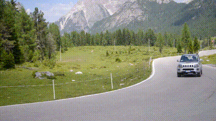

## Project-1 (Computer Vision)

Python implementation of *histogram matching* between two images. The images are taken from [davischallenge.org](https://davischallenge.org). You can download more image sets and their segmentation maps [here](https://data.vision.ee.ethz.ch/csergi/share/davis/DAVIS-2017-Unsupervised-trainval-Full-Resolution.zip). Make sure you run the program on images with only two segments (foreground & background). Refer to the pdf file for full details. *This project was assigned in Computer Vision course at ITU.*

### Libraries to install

* [NumPy](https://pypi.org/project/numpy/)
* [OpenCV](https://pypi.org/project/opencv-python/)
* [MoivePy](https://pypi.org/project/moviepy/)

Original Video            |  Histogram Matching Applied
:-------------------------:|:-------------------------:
  |  
